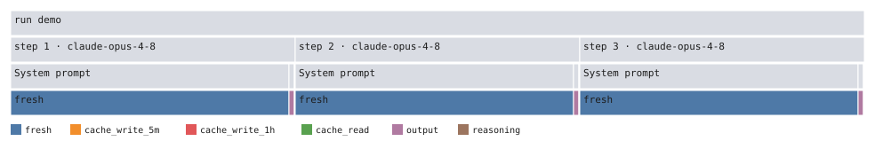
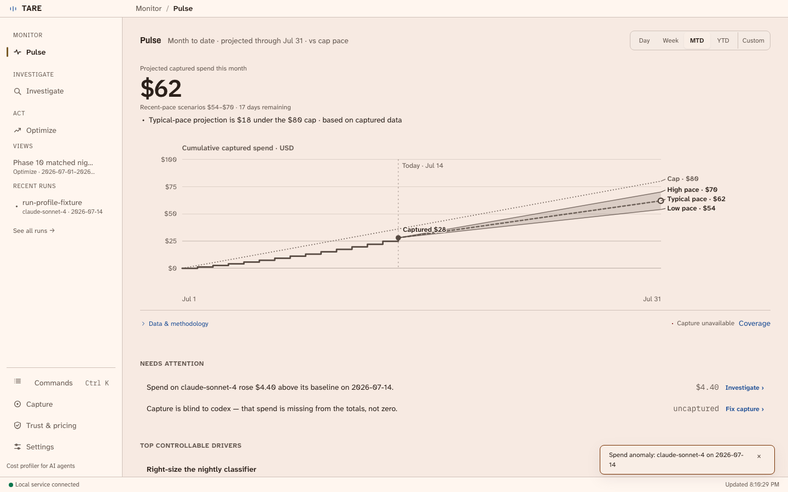
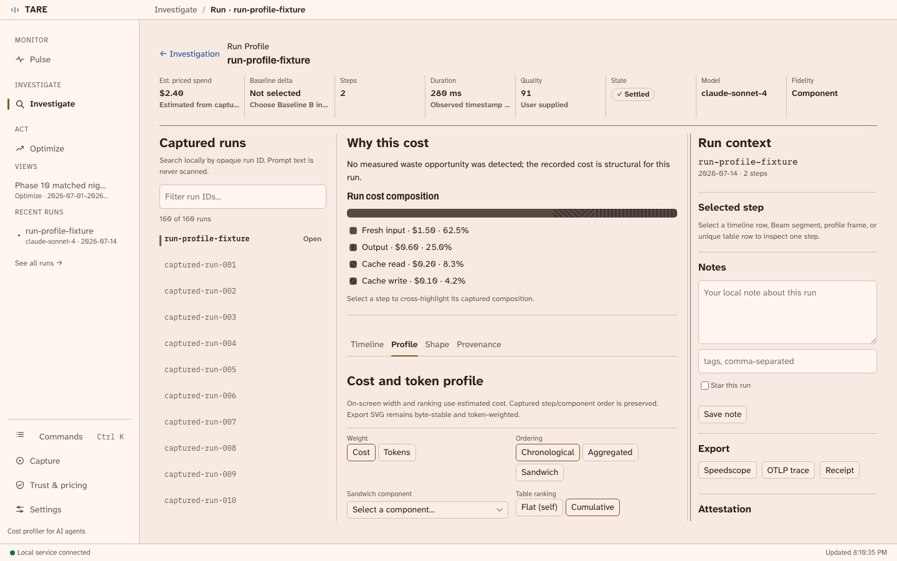
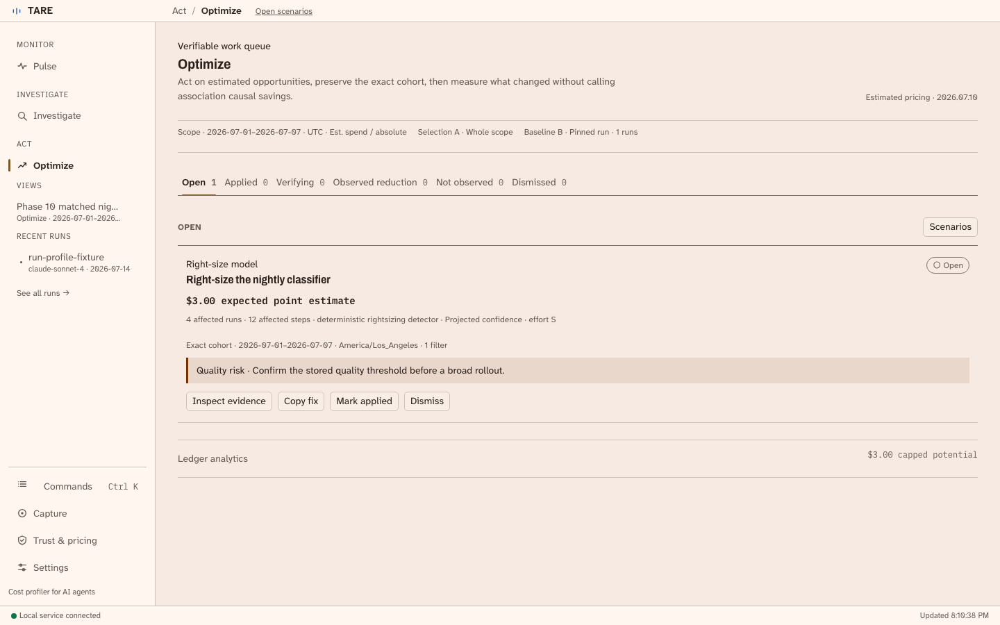

# Tare

> [!WARNING]
> Tare's dollar figures are transparent estimates, not provider invoices, and interfaces may
> change between versions.

**A local-first cost profiler for AI agents.** Tare shows which prompt component, retry loop,
uncached context, or model choice consumed the money—and what you can change—without sending your
prompts to a hosted analytics service.

<p align="center">
  
</p>

## What Tare does

- Captures provider-reported usage through local Claude Code history, OpenTelemetry, an optional
  loopback proxy, or a self-hosted-model metrics agent.
- Attributes tokens and estimated cost to run → step → prompt component → cache class. Counts come
  from provider usage; Tare does not re-tokenize payloads.
- Explains spend through a cost-weighted flamegraph, timelines, comparisons, anomaly causes, and
  prompt/configuration lineages.
- Turns findings into a ranked savings plan with cache advice, model what-if scenarios, budgets,
  regression gates, and before/after verification.
- Recomputes receipts offline with versioned pricing, so an estimate can be checked without an
  account or network request.

Tare is designed for an individual developer analyzing their own local agent usage. It is not a
team analytics SaaS, customer-billing meter, production tracing platform, or authoritative invoice.

## Product surfaces

Every surface reads the same local SQLite store and uses the same Rust accounting engine.

| Surface | Primary use |
| --- | --- |
| **Pulse** | Monitor current spend, budget pace, capture health, anomalies, and active sessions |
| **Investigate** | Explore runs, steps, sessions, time, prompt templates, comparisons, and profiles |
| **Optimize** | Rank savings opportunities, test offline scenarios, and verify applied changes |
| **CLI** | Capture commands, reports, exports, automation, and CI gates |
| **MCP server** | Let an agent query its own recorded spend |

Capture, Trust & Pricing, and Settings are utility sheets in the browser and desktop workbench.

## Quick start

```bash
# Install the CLI from this checkout.
cargo install --locked --path tare-cli

# Start the local capture service and UI.
tare up

# Confirm the store, pricing, receiver, capture, and agent wiring.
tare doctor

# Inspect captured spend.
tare report --today
tare report
```

Interactive bare `tare` is an alias for `tare up`. The service and browser UI bind to loopback by
default; the UI is available at `http://127.0.0.1:8788/__tare/`.

### Choose the capture lane

| Lane | Setup | Fidelity |
| --- | --- | --- |
| **Claude Code JSONL** | None; enabled by default | Counts, model, timing, sessions; no prompt text |
| **OpenTelemetry** | `tare connect`, `codex-connect`, or `gemini-connect` | Live out-of-band usage without entering the request path |
| **Loopback proxy** | Run a command with `tare run -- …` | Deep prompt-component and cache attribution |
| **Self-hosted agent** | `tare agent --scrape … --hub …` | Token deltas from vLLM/llama.cpp-style metrics |

The connection commands are additive and reversible:

```bash
tare connect                 # Claude Code
tare codex-connect           # Codex CLI
tare gemini-connect          # Gemini CLI
tare disconnect
tare codex-disconnect
tare gemini-disconnect
```

For deep attribution on one command, route only that process through Tare's local proxy:

```bash
tare run -- python agent.py
```

See [Running the personal observability mesh](docs/MESH_USAGE.md) for service mode, manual
OpenTelemetry configuration, self-hosted models, and local pricing overlays.

## Common workflows

```bash
# Find and prioritize changes.
tare report
tare plan
tare savings
tare advise

# Compare or model alternatives without another provider call.
tare diff --run before-run --run after-run
tare whatif --recommend --cross-provider
tare trend --anomalies --why

# Export or independently verify a run.
tare export --run RUN_ID
tare attest --run RUN_ID --out receipt.json
tare verify receipt.json

# Enforce a deterministic spend-and-shape gate in CI.
tare gate --max-spend 0.50 --baseline-run BASELINE --fail-on-regression
```

`tare --help` lists the full command surface, including rollups, sessions, cache economics,
lineage, work units, quality signals, reconciliation, heatmaps, receipts, and capture services.
The repository also contains a composite GitHub Action in [action.yml](action.yml).

## How capture fits together

```text
Claude JSONL ─┐
OTLP events ──┼──▶ local capture service ──▶ SQLite ──▶ CLI / web / desktop / MCP
proxy wire ───┤              │
local agent ──┘              └──▶ attribution + effective-dated pricing
```

The OpenTelemetry and history lanes stay out of the model request path. The optional proxy is plain
HTTP on loopback, not a TLS-intercepting MITM, and is used when request-body structure is required
for component-level attribution.

Proxy parsing covers Anthropic Messages, OpenAI-compatible chat completions, Azure OpenAI, Bedrock
Converse, Gemini, and local-model formats. Anthropic and OpenAI proxy fixtures contain real captured
wire bytes; the other proxy parsers are schema-tested where real capture was unavailable. See
[fixture provenance](fixtures/PROVENANCE.md) for the exact boundary.

## Privacy and estimate semantics

- Tare is local-first, account-free, and counts-only by default.
- Authentication headers are forwarded unchanged and never persisted.
- Prompt and response bodies are not stored under the default privacy profiles.
- The opt-in `max_inspect` profile stores scrubbed bodies in a separate local store. Scrubbing is
  best-effort, so treat that store as sensitive.
- Unpriced usage is reported as unpriced rather than silently presented as $0.
- Cost uses integer micro-USD and an effective-dated pricing edition; it remains an estimate rather
  than a provider invoice.

Read [SECURITY.md](SECURITY.md) before enabling payload capture or exposing any local service beyond
loopback.

## Build from source

Prerequisites:

- Rust 1.80 or newer
- Node.js 20 or newer for the web workbench
- Platform WebView libraries only when building the Tauri GUI

```bash
cargo build --release -p tare-cli

cd web
npm ci
npm run typecheck
npm test
cd ..
```

The CLI binary is written to `target/release/tare`. Build and run the desktop shell with:

```bash
cargo run -p tare-tauri --features gui --profile dev-fast
```

The complete repository gate checks formatting, strict Clippy, Rust tests, frontend tests,
Playwright journeys, contrast, generated assets, and privacy invariants:

```bash
cargo fetch
bash scripts/ci.sh
```

`scripts/ci.sh` deliberately runs dependency use offline after caches are populated. Use
`TARE_SKIP_ASSET_GIT_DRIFT=1 bash scripts/ci.sh` in a dirty worktree to compare generated UI
assets byte-for-byte without requiring them to be staged. Regenerate the two tracked embedded UI
trees with `bash scripts/build-ui.sh`.

Linux desktop builds additionally require WebKitGTK 4.1, GTK 3, libsoup 3, and
libayatana-appindicator. macOS and Windows provide their platform WebViews.

## Maintained documentation

| Document | Purpose |
| --- | --- |
| [Mesh usage](docs/MESH_USAGE.md) | Capture services, agent wiring, and self-hosted models |
| [Design guide](docs/DESIGN_GUIDE.md) | Visual, responsive, accessibility, and component rules |
| [Route contract](docs/ROUTES.md) | Canonical browser/desktop deep links |
| [Desktop testing](docs/DESKTOP_TESTING.md) | Browser twin, IPC seam, and manual native checks |
| [Build performance](docs/BUILD_PERF.md) | Fast desktop iteration and build-profile rationale |
| [Release guide](docs/RELEASE.md) | Desktop packaging, signing, and release verification |
| [App imagery](docs/CAPTURE_GIF.md) | Reproducing screenshots, the hero, and the optional GIF |

Contribution and conduct guidance lives in [CONTRIBUTING.md](CONTRIBUTING.md) and
[CODE_OF_CONDUCT.md](CODE_OF_CONDUCT.md).

## Screenshots

These are the real fixture-backed workbench, rendered offline.

<p align="center">
  
</p>

<p align="center">
  <em><strong>Pulse.</strong> Current spend, budget pace, forecast, and attention queue.</em>
</p>

<p align="center">
  
</p>

<p align="center">
  <em><strong>Investigate.</strong> Why a run cost what it did, down to steps and cache classes.</em>
</p>

<p align="center">
  
</p>

<p align="center">
  <em><strong>Optimize.</strong> Evidence-backed changes and before/after verification.</em>
</p>

Regenerate screenshots with `bash scripts/gen-ui-shots.sh`; see
[App imagery](docs/CAPTURE_GIF.md) for details.

## License

MIT — see [LICENSE](LICENSE).
